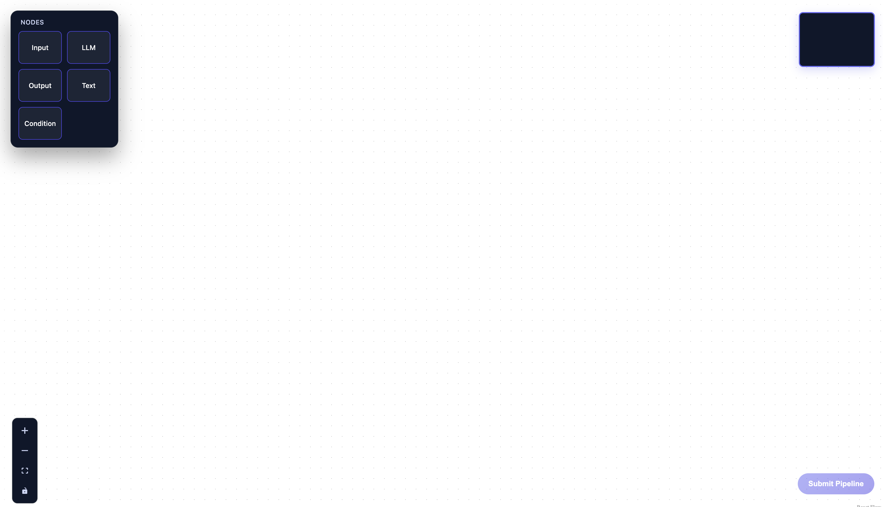
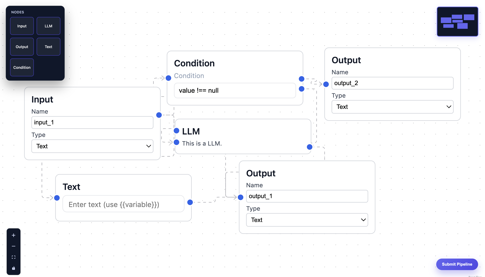
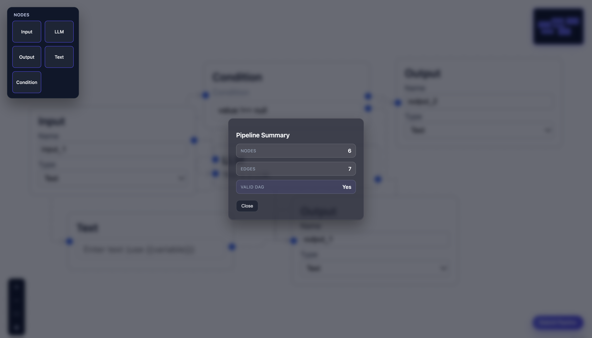
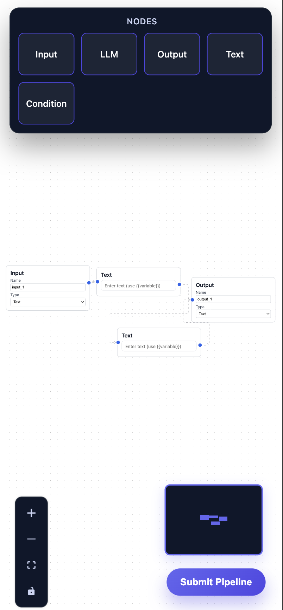

# 🧩 Pipeline Builder (VectorShift-Inspired)

A visual, node-based pipeline editor inspired by tools like VectorShift.  
Users can build workflows by dragging nodes, connecting them visually, and submitting the pipeline for backend validation.

This project focuses on **clean node abstraction, dynamic graph behavior, responsive UI, and solid engineering practices**.

---
 
 
  
  
## 🚀 Features

- Drag & drop workflow editor using **ReactFlow**
- Reusable **BaseNode abstraction**
- Dynamic input handles (Text node variables via `{{variable}}`)
- Multi-input and multi-output nodes
- Branching logic with a Condition node
- Backend DAG validation
- Fully responsive (desktop + mobile)
- Modern dark UI with glassmorphism modal
- Global state management using **Zustand**

---

## 🧱 Node Types

| Node | Description |
|-----|------------|
| **Input** | Entry point for data |
| **Text** | Text templating with dynamic variables (`{{var}}`) |
| **LLM** | Multi-input processing node |
| **Condition** | Branches flow into `true` / `false` paths |
| **Output** | Final sink node |

---

## 🧠 Architecture Overview

### Frontend
- **React + Vite**
- **ReactFlow** for graph rendering
- **Zustand** for state management
- Centralized `BaseNode` component that handles:
  - Layout
  - Input/output handles
  - Handle positioning logic

Each node focuses only on its **own behavior and UI**, keeping the system scalable and clean.

### Backend
- **FastAPI**
- Single endpoint to:
  - Parse pipeline
  - Count nodes and edges
  - Validate whether the pipeline is a valid DAG

---

## 📂 Project Structure

Frontend/
├── Components/
│   ├── DraggableNode.jsx
│   ├── Toolbar.jsx
│   ├── Submit.jsx
│   ├── Store.js
│   └── PipelineModal.jsx
│
├── Layout/
│   ├── BaseNode.jsx
│   └── PipelineUI.jsx
│
├── Nodes/
│   └── NodeComponents/
│       ├── InputNode.jsx
│       ├── TextNode.jsx
│       ├── LLMNode.jsx
│       ├── ConditionNode.jsx
│       └── OutputNode.jsx
│
├── Styles/
│   ├── Components/
│   └── Nodes/
│
└── main.jsx

Backend/
├── main.py
└── functions/
    └── dag.py


---

## ▶️ Running the Project

To start the backend, navigate to the `Backend` directory, activate the virtual environment, and run the FastAPI server using:

```bash
cd Backend
source venv/bin/activate
python -m uvicorn main:app --reload 
This starts the backend server locally on http://127.0.0.1:8000.

To start the frontend, navigate to the Frontend directory, install dependencies, and start the development server: 
cd Frontend
npm install
npm run dev 

The frontend application runs locally on http://localhost:5173.
```
## WorkFlow Example 

An example workflow created using the editor is:
Input → Text → LLM → Condition → Output 
	•	The Text node dynamically generates input handles from {{variables}}
	•	The LLM node supports multiple inputs
	•	The Condition node demonstrates branching using true and false outputs
	•	The backend validates whether the pipeline forms a valid DAG


### Extra Information 

The Text node dynamically generates input handles based on variables written using the {{variable}} syntax. The LLM node supports multiple inputs, while the Condition node demonstrates branching logic by routing execution to true or false outputs. On submission, the backend parses the pipeline, counts nodes and edges, and validates whether the pipeline forms a valid Directed Acyclic Graph (DAG).

The system is built around a BaseNode abstraction that centralizes layout and handle logic. Individual nodes only define their unique behavior and UI. Inputs and outputs are passed declaratively, allowing dynamic nodes and multi-input/multi-output configurations without special casing. Handle positioning uses percentage-based calculations to ensure handles remain within node boundaries even as node size or input count changes.

The interface is fully responsive. On desktop, the toolbar, minimap, controls, and submit button are positioned for a traditional editor experience. On mobile devices, the toolbar moves to the top center, controls move to the bottom-left, the submit button stays at the bottom-right, and the minimap stacks above the submit button, ensuring no overlap and maintaining usability on smaller screens.

Global state for nodes, edges, and connections is managed using Zustand, while ReactFlow handles graph rendering and interactions. The design avoids redundant local state and focuses on clarity, stability, and extensibility.

The project is complete, polished, and ready for submission. Potential future improvements include runtime execution of pipelines, persistence to a database, and additional node-level validation or configuration options.

---